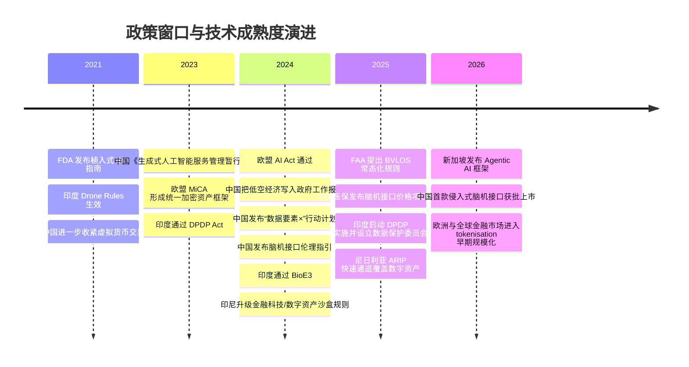
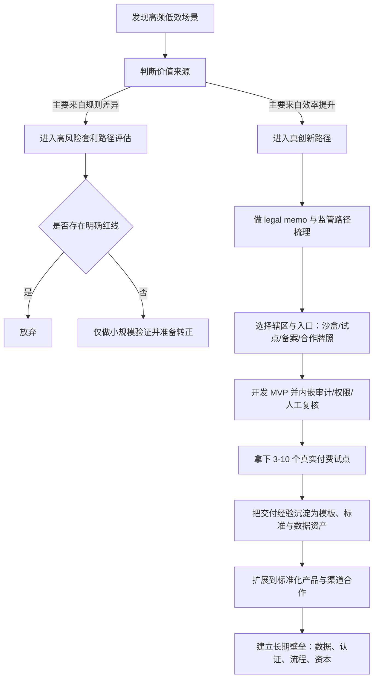

# 乘法世界中的指数级赚钱路径研究报告

**执行摘要**  
到 2026 年，乘法效应不是在减弱，而是在向“更技术化、更合规化、更资本化”三个方向同时加剧：代码、数据、自动化和可编程金融仍在持续放大头部回报；但真正能长期赚钱的，不再是粗糙的漏洞套利，而是“技术先行、规则跟进、你先把合规内嵌进产品”的路径。对中文创业者最现实的优先序是：垂直 AI 代理与数据工作流、工业自动化、低空/空间下游软件与服务、合规化金融与数据基础设施；而脑机接口、合成生物、商业航天更适合有团队、有耐心、有资本的人做。citeturn0search8turn20view0turn19view6turn16search9turn17search5

## 研究目标与范围

你上传的底稿把“乘法效应”拆成代码、媒体、网络效应、信用、地理套利和判断力等杠杆，这个视角很适合作为创业/投资分析的出发点。fileciteturn0file0 本报告在此基础上，只讨论**合法合规、可持续**的指数级增长路径，不提供规避监管、逃避牌照、绕开义务或其他违法操作建议。监管越来越快，真正值钱的，不是“藏起来”，而是“先跑起来，但从第一天就能解释自己为什么合法、为什么有用、为什么风险可控”。这一点已经在 AI、数据、低空、数字资产和医疗科技等领域反复出现。citeturn13search0turn1search0turn1search0turn16search9turn20view0

### 乘法效应的可操作定义

本报告将“乘法效应”定义为：**单位新增投入带来的新增产出，不是近似线性增加，而是通过复制、复用、网络反馈、制度许可或资本结构形成非线性放大**。可操作地看，一个行业如果同时满足以下三类信号中的两类以上，就可以认为具备“乘法潜力”：

| 维度 | 绿灯信号 | 黄灯信号 | 红灯信号 |
|---|---|---|---|
| 复制性 | 核心产品/模型可跨客户快速复用，边际交付成本持续下降 | 需要较多定制，但模板化空间存在 | 每新增客户都要重做一套 |
| 放大器 | 有代码、数据、网络、许可、渠道、资本等复利杠杆 | 只有单一杠杆 | 主要靠人力堆砌 |
| 规模关系 | 收入增速长期快于人头增速；或单个资产可服务多场景 | 部分阶段成立 | 人越多才赚越多 |
| 留存与壁垒 | 数据、流程、认证、供应链、生态位形成复利 | 有壁垒但可替代 | 完全同质化 |
| 监管适配 | 可以通过沙盒、试点、备案、行业准入逐步扩张 | 规则不清但可沟通 | 明确禁止或高度可能触碰红线 |

以上指标与许多官方框架的底层逻辑一致：**NIST** 的 AI 风险框架强调在生命周期中识别风险并建立治理；**新加坡** 的 Agentic AI 框架则把“先限定能力边界、再做人类问责、再做技术控制”作为部署前提；**中国** 的“数据要素×”行动计划直接把“乘数效应”写入目标，并给出应用场景和产业生态指标。citeturn0search1turn20view0turn19view6

### 制度盲区、政策窗口与监管套利的判定标准

“制度盲区/政策窗口/监管套利”这三个概念，实操中一定要分开。它们看起来都像“规则没完全定型”，但质量差异极大。

| 概念 | 定义 | 可操作判定 |
|---|---|---|
| 制度盲区 | 技术或商业模式已经出现，但专门规则尚未成形 | 只有原则性法律，没有专门细则；地方口径不一；主要靠个案审批、豁免或试点 |
| 政策窗口 | 政府明确鼓励某方向，但标准、牌照、定价、基础设施还没完全固化 | 有白皮书/规划/试点/补贴/沙盒；产业链开始建；先发者可卡位标准与客户 |
| 监管套利 | 利润主要来自法律分类差异、轄区差异或会计/牌照差异，而非真实效率提升 | 如果去掉牌照差、税差、跨境差，商业模式就大幅失去盈利性 |

我的建议是用一个非常简单的实操阈值：**如果超过一半的单位经济性来自“客户效率提升、成本下降、体验改善”，这是创新；如果超过一半来自“别人还没来得及管/不同地方定义不一样”，这更接近套利。** 前者可以穿越监管；后者通常只能抢时间。欧盟在 AI、数据与加密资产上选择了“先立统一框架再放大创新”，中国在数据要素、低空与生成式 AI 上选择了“鼓励+分层规范”，新加坡则把“沙盒+治理框架”变成国际竞争力的一部分。citeturn1search0turn1search1turn1search6turn13search0turn19view6turn20view0

## 行业与技术图谱

从今天往后看，真正符合“乘法世界”特征的行业，不是所有热门行业，而是那些**同时具有技术复用、规则可扩展、客户粘性和资本/网络杠杆**的行业。整体上，我的判断是：**现象会加剧，但“元素”会减少并升级**。也就是说，粗糙的漏洞会越来越少，但高质量的乘法元素——算力、数据、自动化、许可、标准接口、合规能力、资本协同——会变得更集中、更稀缺，也更贵。这个判断来自多个同步信号：AI 正在继续提升生产率；机器人密度和商业航天/低空基础设施在扩张；而监管框架正从“没人管”转向“可管、可测、可审计”。citeturn0search8turn3search17turn16search4turn16search9turn20view0turn17search5

### 重点赛道清单

| 赛道 | 乘法机制 | 近年官方/权威信号 | 规模化路径 | 主要风险 |
|---|---|---|---|---|
| AI 代理 | 代码杠杆、流程杠杆、数据飞轮、判断力放大 | 2025 AI Index 继续确认 AI 对生产率的正面影响；新加坡 2026 发布 Agentic AI 框架，说明企业级部署已进入“可治理扩张”阶段 | 从单点 copilot 升级为端到端 workflow agent；先做垂直场景，再做平台化工具链 | 数据泄露、越权行动、模型幻觉、责任归属 |
| 数据要素市场 | 数据复用、合规杠杆、制度性许可、生态位 | 中国要求到 2026 年形成 300+ 典型场景、数据产业年均增速超过 20%、交易规模倍增；欧盟 Data Act 强化公平获取与使用规则 | 从数据治理/标注/脱敏/授权工具切入，逐步做数据产品、行业交换、可信执行环境 | 隐私、跨境、确权、数据质量、采购周期长 |
| 自动化制造 | 代码+设备+供应链复利，地理套利 | 全球工厂机器人密度 2023 年达 162；中国 2023 年机器人密度已到 470，位居全球前三，且 2024 年全球新装机器人 54% 部署在中国 | 从单工序自动化、质检、排程和视觉系统切入，再向 MES/ERP/供应链控制塔延伸 | CAPEX、交付长周期、工业安全、客户切换慢 |
| 低空经济 / 商业航天 | 牌照杠杆、基础设施杠杆、网络调度 | 中国把低空经济写入 2024 政府工作报告，并提出到 2030 年形成城市空运、物流配送、应急等规模化应用；美国 FAA 在 2025 年提出 BVLOS 常态化规则；美国 FY2025 获批商业太空操作已达 204 次 | 先做软件和服务：调度、合规、仿真、载荷、巡检、保险、数据；不要一开始就重资产整机 | 空域与安全责任、适航认证、地方执行差异、资本消耗 |
| Web3 / RWA / 代币化金融 | 可编程金融、资本复用、24/7 结算、链上组合性 | BIS 2025 把 tokenisation 视为下一代货币金融系统的重要创新；新加坡继续推进 Project Guardian 及稳定币框架；欧盟 MiCA 已成统一框架；美国 2025 有稳定币专项立法、但 SEC 继续强调“tokenized securities 仍是 securities” | 只在规则清晰辖区做：基金份额、债券、贸易融资、供应链金融、合格投资者产品 | 证券法、牌照、托管、AML/CFT、消费者保护 |
| 金融科技 | 支付网络、许可复利、风控模型、网络效应 | 印度 UPI 2026 年 3 月月交易量已达 226.41 亿笔；印尼 OJK 2024 升级 FSTI/数字资产沙盒；尼日利亚 SEC ARIP 明确为 VASP/数字投资快速通道 | 依附公共支付 rails 或牌照合作方，从场景支付/风控/商户 SaaS 切入 | 牌照、客户资金隔离、反洗钱、欺诈、资本金 |
| 平台型媒体 / 内容 | 媒体复制、算法分发、网络效应、品牌/IP | AI 工具降低内容生产门槛，内容分发越来越“头部复利、尾部拥挤” | 不建议把“纯内容”当主业；更适合作为获客与分发层，为 SaaS、教育、社群、投研导流 | 平台依赖、版权、流量波动、变现天花板 |
| 合成生物 | IP 杠杆、工艺复利、专利/标准壁垒 | 中国“十四五”生物经济规划、印度 2024 BioE3 政策都明确把生物制造放在国家级优先位置；美国 2025 撤销部分此前生物制造行政命令，显示政策连续性存在波动 | 先做上游工具/服务（菌株设计、自动化实验、Bio-IT、LIMS、发酵优化），再做高毛利材料或药械 | 研发周期长、监管长、试验失败率高、资本密集 |
| 脑机接口 | 许可杠杆、IP 壁垒、医疗支付编码、平台性硬件 | FDA 早有植入式 BCI 指南；中国 2024 发布脑机接口伦理指引，2025 医保给出价格项目立项，2026 批准首款侵入式脑机接口医疗器械上市 | 大机会不在“个人做整机”，而在电极、算法、测试、康复软件、临床流程、数据平台和合规服务 | 伦理、临床、隐私、安全、极高研发与监管门槛 |

上表中的政策和产业信号，主要来自官方法规、监管公告和行业权威报告，包括 AI Index 2025、NIST AI RMF、IMDA Agentic AI 框架、中国“数据要素×”行动计划、中国低空与生物经济规划、IFR 机器人报告、FAA BVLOS 与商业航天资料、BIS/SEC/MAS/欧盟相关法规，以及印度、印尼、尼日利亚、南非等地的官方沙盒与数字金融规则。citeturn0search8turn0search1turn20view0turn19view6turn13search5turn19view5turn3search17turn16search9turn16search4turn17search1turn23view0turn1search6turn4search13turn4search0turn19view9turn19view10turn19view11turn15search0turn15search1

### 行业对比表

| 赛道 | 杠杆类型 | 进入门槛 | 时间窗口 | 监管敏感度 | 预期回报分布 |
|---|---|---:|---|---:|---|
| AI 代理 | 代码 / 数据 / 判断力 | 中 | 现在到未来 24 个月 | 中高 | 幂律很强，头部极集中 |
| 数据要素 | 合规 / 数据 / 渠道 | 中高 | 现在到未来 36 个月 | 高 | 稳定复利，平台型回报 |
| 自动化制造 | 代码 / 设备 / 地理 | 中高 | 现在到未来 48 个月 | 中 | 中位数较好，头部明显 |
| 低空 / 商业航天 | 牌照 / 基础设施 / 网络 | 高 | 现在到未来 60 个月 | 很高 | 典型“少数赢家” |
| Web3 / RWA | 资本 / 可编程性 / 合规 | 中高 | 强依辖区，窗口分化 | 很高 | 双峰分布，极好或极差 |
| 金融科技 | 支付网络 / 风控 / 许可 | 中高 | 现在到未来 36 个月 | 很高 | 中高回报，监管决定上限 |
| 平台媒体 / 内容 | 媒体 / 网络 / 品牌 | 低 | 永远存在但极拥挤 | 中 | 极端头部、尾部低收益 |
| 合成生物 | IP / 工艺 / 专利 | 很高 | 未来 36–84 个月 | 很高 | 低命中率、高上限 |
| 脑机接口 | 医疗许可 / IP / 支付编码 | 很高 | 未来 36–96 个月 | 极高 | 超长周期、高上限 |

这张表的“时间窗口”和“回报分布”不是官方评分，而是基于当前法规是否已明朗、技术是否进入可落地阶段、以及先发者能否建立标准/数据/渠道壁垒所作的实务综合判断。最适合**个人与小团队**的，仍然是 AI 代理、数据工具、工业软件与分发层；最适合**机构与有强资源团队**的，是低空/航天、合成生物、脑机接口与合规化 RWA。citeturn20view0turn19view6turn19view5turn16search9turn17search1turn15search0

### 政策窗口与技术成熟度时间线

下图展示的不是“哪个行业最火”，而是**哪些行业同时满足了技术成熟度上升与政策框架成形**这两个条件。通常只有两者同时出现，才适合放大投入。

这条时间线背后的核心结论是：**未来不是“没规则”，而是“规则越来越早到来，但先发者仍然能在规则固化前建立优势”。** 因此最值得进入的，不是完全无监管的地带，而是“已经开始被监管，但监管仍允许试点、仍欢迎标准制定者进入”的地带。citeturn14search1turn7search5turn17search3turn13search0turn1search6turn5search0turn1search0turn0search2turn0search11turn14search0turn7search9turn16search9turn15search1turn5search10turn5search8turn19view10turn20view0turn15search0turn17search5

## 国家与制度比较

从创业/投资角度看，各国差异不在于“有没有机会”，而在于**机会的类型**。大体可以分为四种：  
第一类是**政策牵引型市场**，如中国、印度；第二类是**规则清晰型市场**，如欧盟、新加坡；第三类是**资本与研发深水区**，如美国；第四类是**高波动、高弹性的新兴试点市场**，如印尼、肯尼亚、尼日利亚和南非。世界银行 WGI、WJP Rule of Law Index 和 Transparency International CPI 可以作为底层治理代理指标，但对创业者来说，更关键的是：有没有沙盒、有没有主管部门可对话、有没有明确禁止项、有没有可复制的本地合作路径。citeturn1search3turn2search1turn2search0

### 国别优先级与进入策略

| 市场 | 制度画像 | 更适合的行业优先级 | 推荐进入策略 | 明确谨慎项 |
|---|---|---|---|---|
| entity["country","中国","east asia"] | 执行力强、政策驱动快、试点密集、合规要求上升快 | 低空、工业 AI、自动化制造、数据要素、脑机接口 | 做 B2B/B2G 试点，争取标准、示范区、产业链协同；用合规、交付和本地资源建立壁垒 | 公开代币发行、虚拟货币交易、公募式金融创新 |
| entity["country","美国","north america"] | 资本深、研发强、联邦与州并存、规则碎片化但市场大 | AI 代理、商业航天、脑机接口、合成生物、合规型 tokenization | 先选单州/单行业做穿透；重视法律意见、保险、责任边界设计 | 消费金融、证券、数据、医疗跨州合规复杂 |
| entity["organization","欧盟","supranational union"] | 规则清晰、跨国一体化、增长速度较稳 | 合规 AI、工业数据共享、RWA/加密资产、工业自动化 | 采用 privacy-by-design、audit-by-design、CE/标准先行路线 | 灰色增长黑客、未经分类的高风险 AI |
| entity["country","印度","south asia"] | 数字公共设施强、市场大、监管正在快速落地 | Fintech、AI for MSME、无人机、BioE3 相关生物制造 | 依托 UPI/公共数字基础设施，从高频低客单价场景切入 | 数据合规、价格敏感、执行细节变化快 |
| entity["country","新加坡","southeast asia"] | 规则友好、沙盒成熟、国际金融枢纽、市场小但信号强 | RWA、跨境金融基础设施、企业 AI 治理与审计 | 以牌照合作、试点、国际标准与资金对接为主 | 不适合把大众消费规模当核心逻辑 |
| entity["country","印度尼西亚","southeast asia"] | 大市场、数字金融进展快、OJK 沙盒升级 | Fintech、数字资产、物流/消费科技、AI 运营工具 | 设本地实体，与银行/支付/电商伙伴共建场景 | 牌照、反欺诈、数据与消费者保护 |
| entity["country","越南","southeast asia"] | 制造业承接强、数据规则趋严、国家主导性更强 | 制造数字化、供应链 SaaS、自动化、工业数据 | 从制造出口链条和园区切入，不要先做重消费者数据生意 | 消费级数据密集与灰色数字资产 |
| entity["country","肯尼亚","east africa"] | 金融创新活跃、资本市场沙盒清晰、东非门户 | Fintech、农金、物流、RegTech | 走 CMA 沙盒或合作机构，先做小规模真实场景测试 | 收入规模、汇率、基础设施波动 |
| entity["country","尼日利亚","west africa"] | 需求强、波动强、数字资产与 fintech 并行推进 | 支付、数字资产、贸易金融、风控 | 必须做本地合规、AML 和资金管理；适合高风险偏好团队 | 反洗钱、外汇、欺诈与政策波动 |
| entity["country","南非","southern africa"] | 正式金融体系最强、监管工具成熟、合规成本较高 | RegTech、InsurTech、机构型 tokenization | 与持牌机构、保险、银行体系合作；做合规增效工具 | 若把灰色数字资产业务当主线，合规压力会很高 |

上表是综合判断，不是官方国家排名。判断依据包括：欧盟 **AI Act / Data Act / MiCA**，印度 **DPDP Act / BioE3 / Drone Rules / UPI**，新加坡 **Agentic AI / AI Verify / stablecoin / Project Guardian**，印尼 **POJK 3/2024 与沙盒配套**，肯尼亚 **CMA Regulatory Sandbox**，尼日利亚 **ARIP 与 VASP 规则**，南非 **POPIA 与 IFWG Sandbox**，以及中国在数据、低空、生成式 AI、脑机接口方面的现行政策。citeturn1search0turn1search1turn1search6turn5search0turn7search9turn7search5turn4search0turn20view0turn6search0turn4search13turn19view9turn8search6turn11search2turn19view10turn10search2turn12search3turn12search1turn13search0turn19view6turn19view5turn15search1turn15search0

### 国别结论

如果你偏**创业落地**，中国、印度、印尼和越南更适合找政策窗口与产业链协同；如果你偏**制度清晰与国际融资**，新加坡和欧盟更优；如果你偏**重研发与超大市场**，美国仍然是高上限选项；如果你偏**高弹性试点**，肯尼亚、尼日利亚和南非适合做支付、数字资产、监管科技和普惠金融。真正要避开的，不是“监管严格”的地方，而是**业务核心依赖规则模糊、且一旦澄清就失去全部利润来源**的地方。citeturn20view0turn19view10turn19view11turn16search9turn17search5

## 判定框架与量化指标

为了把“行业感觉”变成“可筛选的项目评分”，我建议使用一套简化的 **M-Window Score** 模型。它的目的不是预测未来，而是把模糊判断压缩成一个可以比较的决策工具。

### M-Window Score 评分体系

| 维度 | 权重 | 打分方式 | 公开信号 |
|---|---:|---|---|
| 市场空白度 W | 20 | 1–5 分；玩家越少、增速越快、越细分越高 | 新增公司数、招标/RFP 密度、细分客户痛点是否仍靠人工解决 |
| 监管窗口 R | 15 | 1–5 分；越处于“鼓励+试点+细则未固化”越高 | 是否有沙盒、试点、征求意见稿、地方示范区 |
| 技术可复制性 T | 15 | 1–5 分；越模块化、复用率越高越高 | 上线一套模型/流程后，跨客户部署时间是否持续下降 |
| 网络效应 N | 15 | 1–5 分；数据飞轮、双边平台、标准接口越强越高 | 用户-数据-模型是否形成正反馈 |
| 资本效率 C | 10 | 1–5 分；越省钱越高 | MVP 所需月 burn、硬件/试验/监管资本需求 |
| 护城河 M | 10 | 1–5 分；认证、数据、标准、IP、供应链越强越高 | 是否能形成专利、认证、供应链绑定、流程嵌入 |
| 分发可达性 D | 10 | 1–5 分；越能通过现有渠道/API/合作方快速到客户越高 | 是否能借助平台、产业链、牌照方、政府采购进场 |
| 政策顺风 P | 5 | 1–5 分；被官方明确鼓励越高 | 规划、补贴、白名单、园区、标准制定机会 |
| 红线惩罚 X | -40 / -20 / 0 | 命中明确禁止项就重罚 | 无牌照碰资金、无伦理审批碰医疗、违规跨境数据、空域/证券/AML 红线 |

建议公式为：  
**总分 = 20W + 15R + 15T + 15N + 10C + 10M + 10D + 5P - X**  
其中每个子项先按 1–5 打分，再按权重折算为百分制。

### 阈值建议

| 总分 | 建议动作 |
|---:|---|
| 75 分以上 | 可集中资源进入；适合做产品化和融资 |
| 60–74 分 | 先做付费试点；不宜过早扩团队 |
| 45–59 分 | 只做访谈、原型或 LP/顾问式布局 |
| 45 分以下 | 不适合创业主线；最多做观察或二级投资 |
| 命中重红线 | 不做 |

这个模型最关键的一点，是把“看起来性感”的赛道和“可以规模化赚钱”的赛道分开。比如脑机接口、合成生物、商业航天技术热度很高，但对普通创业者往往资本效率极低；而 AI 代理、行业数据工具、工业软件虽然没那么“传奇”，但更容易穿越 0–18 个月阶段。官方信号也支持这种区分：AI 已经表现出生产率提升，数据要素与工业自动化被政策与产业同时拉动，而脑机接口和航天则更像“高门槛、高赔率”的远期赌局。citeturn0search8turn19view6turn3search17turn16search4turn15search0

### 样例评分表

| 赛道 | 个人创业者 | 早期团队 | 机构投资者 | 备注 |
|---|---:|---:|---:|---|
| AI 代理 | 82 | 85 | 78 | 适合最快起步，但需要强场景聚焦 |
| 数据要素工具 | 68 | 76 | 80 | 销售慢，但护城河可持续 |
| 自动化制造软件 | 65 | 79 | 84 | 需要行业 know-how，回报更稳 |
| 低空软件/服务 | 48 | 71 | 86 | 对个人过重，对机构更适合 |
| Web3/RWA（新加坡/欧盟） | 42 | 69 | 81 | 仅限合规辖区；中国大陆应低分处理 |
| Fintech（印度/印尼/非洲） | 55 | 74 | 82 | 牌照与反欺诈能力决定上限 |
| 合成生物工具链 | 28 | 52 | 79 | 个人不适合，机构可做长期配置 |
| 脑机接口工具链 | 22 | 49 | 77 | 适合围绕测试、软件、临床流程做“卖铲子” |
| 平台媒体/内容 | 61 | 66 | 50 | 适合作为分发层，不宜单独当主业 |

这张样例表不是“行业真理”，而是给你一个最重要的判断习惯：**先按自己的资源端评分，而不是按行业新闻热度评分。** 同一个赛道，对个人、团队、机构是完全不同的生意。citeturn20view0turn19view6turn19view10turn16search9turn15search0

## 合规与风险缓解策略

真正能赚大钱但不翻车的项目，几乎都有一个共同点：**把合规当成产品的一部分，而不是融资后的补丁。** 在 AI、金融、医疗、低空、数据交易这些赛道里，合规本身就是杠杆——它既降低被一刀切的概率，也提高后来者的进入成本。新加坡对 Agentic AI 的态度非常典型：允许创新，但要求先界定代理边界、建立人类问责、技术测试、白名单服务和终端透明度；美国 FAA 对 BVLOS 的推进也是如此：不是放开天，而是把可报告、可记录、可授权的规范一起建立。citeturn20view0turn16search9

### 真创新与钻空子的分叉点

| 路径 | 收入来源 | 监管后果 | 是否值得做 |
|---|---|---|---|
| 真创新 | 来自效率、体验、质量、风险控制的实质提升 | 规则成熟后利润可能下降，但业务继续存在 | 值得长期做 |
| 政策窗口型创新 | 来自政策鼓励期的补贴、试点与先发客户 | 规则成熟后需要从“窗口红利”切换到“运营壁垒” | 值得做，但要尽快转型 |
| 纯监管套利 | 来自法律分类差、跨境差、会计差、牌照差 | 规则一旦统一，利润和估值一起塌 | 除非你是专业法律/资本玩家，否则不值得做 |

### 合规前置动作清单

| 模块 | 必做动作 | 适用行业 |
|---|---|---|
| 法律意见 | 出具书面 legal memo：牌照、数据、证券、医疗、航空、税务、跨境 | 全部 |
| 监管接口 | 主动确认是否能走沙盒、备案、试点、伦理审查、临床/适航路径 | 金融、AI、医疗、低空、数据 |
| 技术控制 | 审计日志、权限分层、人工复核、kill switch、事件上报 | AI 代理、金融、低空 |
| 数据治理 | 数据来源证明、同意机制、脱敏、最小化、跨境路径 | AI、数据要素、Fintech、医疗 |
| 资金安全 | 客户资金隔离、托管、对账、反洗钱、欺诈监测 | Fintech、Web3/RWA |
| 临床/伦理 | IRB/伦理、受试者同意、数据安全、器械注册路径 | 脑机接口、医疗 AI、合成生物 |
| 公共关系 | 风险沟通手册、媒体口径、监管问询 Q&A | 全部 |
| 保险与合同 | 产品责任险、网络险、SLA、责任边界、披露文件 | 全部 |

### 政策博弈的正确方式

所谓“与政策博弈”，在实操里不是“藏”，而是**透明地参与规则形成**。最有效的四种打法是：

一是进入沙盒、试点、示范区。印尼 OJK、肯尼亚 CMA、尼日利亚 SEC、南非 IFWG 都把这件事制度化了；这意味着你不仅可以测试产品，还能从“试点对象”变成“监管学习样本”。citeturn19view9turn11search2turn19view10turn19view11

二是加入标准/行业组织。低空、数据交易、AI 治理、RWA 这些行业，一旦你参与标准制定，你就把“合规成本”变成了自己的护城河。

三是把公共利益写进产品故事。监管最愿意支持的，不是“我想赚钱”，而是“我能降低欺诈、提高效率、增加透明、服务小微、减少碳排、支持医疗可及性”。

四是准备“路线 B”。如果某条规则收紧，你是能切换到 B2B、机构客户、境外合规辖区，还是直接死亡？这个问题必须在第一轮融资前想清楚。

### 从发现空白到规模化的流程图

## 进入路线图与资源配置

下面给出三个最常见角色的分阶段路线图。预算不是官方口径，而是便于中文读者决策的通用区间假设；若你做的是脑机接口、合成生物、商业航天，请把预算系数乘以 **5–20 倍**；若你做的是 AI 代理、内容分发、轻量数据工具，则可乘以 **0.3–0.6 倍**。

### 分阶段行动计划

| 角色 | 阶段 | 关键目标 | 关键里程碑 | 核心技能/人才 | 通用预算与融资建议 |
|---|---|---|---|---|---|
| 个人创业者 | 0–18 个月 | 找到一个高频、可复用的垂直效率场景 | 3 个付费客户；首个可复制模板；合规底稿完成 | 产品、销售、自动化、基础法务意识 | 20–100 万元；自筹/天使；不要先招大团队 |
| 个人创业者 | 18–36 个月 | 从项目制转产品制 | 月留存稳定；10–30 个客户；形成标准报价与实施法 | 客户成功、数据治理、渠道合作 | 100–500 万元；小额种子轮即可 |
| 个人创业者 | 36+ 个月 | 建壁垒和第二增长曲线 | 进入行业生态；形成 API/平台/数据壁垒 | 渠道、财务、组织搭建 | 500–2000 万元；按 ARR 与毛利融资 |
| 早期团队 | 0–18 个月 | 选择一个半监管赛道切入 | 完成 legal memo、试点协议、MVP、首批客户 | 行业 BD、技术负责人、合规负责人 | 100–500 万元；Pre-seed / Seed |
| 早期团队 | 18–36 个月 | 卡位许可、数据或流程壁垒 | 进入沙盒/试点；形成 1–2 个标杆案例 | 交付、风控、法务、解决方案 | 500–3000 万元；A 轮前后 |
| 早期团队 | 36+ 个月 | 区域扩张或上下游整合 | 获得行业级合作方；形成标准接口/认证 | CFO、政策事务、质量体系 | 3000 万–1 亿元；视赛道而定 |
| 机构投资者 | 0–18 个月 | 建立赛道地图与主题清单 | 建立 30–50 家项目池；区分“真创新/套利” | 行业研究、法律、技术尽调 | 单项目 300–3000 万元，保留 2–3 倍 follow-on |
| 机构投资者 | 18–36 个月 | 强化组合结构 | 形成“轻资产快回款”和“重资产高赔率”组合 | 产业协同、政策关系、投后 | 重点加仓能取得牌照、标准或数据权的项目 |
| 机构投资者 | 36+ 个月 | 把监管变化变成 alpha | 推动被投企业进入示范区、标准组织、并购通道 | 投后运营、并购、国际化 | 以并购/二级退出/产业买方为主线 |

### 对中文读者最现实的起步顺序

如果你今天从零开始，最现实的顺序不是“追最酷的技术”，而是：

先做 **垂直 AI 代理 / 数据工作流 / 合规与审计工具**。这一层最容易在 6–12 个月内验证付费，也最容易把你送进更大的产业入口。citeturn0search8turn20view0

然后看你是否有产业资源。如果你能接触制造、能源、物流、园区、医院、金融机构，就把工具层延伸到 **工业自动化、数据要素、低空服务、合规金融基础设施**。这一层的特点是销售慢，但一旦进去，就比纯软件更难替代。citeturn19view6turn3search17turn19view5turn16search9

最后，只有当你具备资本、科研或牌照资源时，再考虑 **脑机接口、合成生物、商业航天整机或重研发金融基础设施**。这些行业能造就非常高的回报，但不是靠“快”，而是靠“熬到别人进不来”。citeturn15search0turn13search5turn16search4

## 案例研究与历史镜鉴

### 成功与失败案例

| 案例 | 路径类型 | 结果 | 赛道命运如何被监管改变 |
|---|---|---|---|
| entity["company","博睿康医疗","shanghai medtech"] 与中国脑机接口路径 | 真创新 + 政策窗口 | 成功推进到“价格项目→产品获批→临床可接入” | 2024 伦理指引、2025 价格项目、2026 获批上市，说明监管不是堵死，而是在给高门槛创新铺路 |
| 中国 P2P 网贷出清 | 监管套利居多 | 大规模失败与清退 | 当局通过专项整治、出清公告、规则统一，迅速把“野蛮增长”改造成“不得继续”的状态 |
| 新加坡 Project Guardian / 稳定币路径 | 合规化金融创新 | 成功成为全球 tokenization 样板 | 通过监管框架和行业协作，把最容易灰化的赛道，转成“机构先行、规则先行” |
| entity["company","SpaceX","aerospace company"] 所代表的美国商业航天 | 真创新 + 许可基础设施 | 成功把高风险行业变成可持续商业化行业 | FAA 的职责不是放任，而是通过许可、监督和站点管理，把航天从一次性项目变成商业体系 |
| 美国 BVLOS 无人机常态化推进 | 政策窗口型创新 | 成功打开低空运营规模化前提 | 当 FAA 从豁免走向拟议规则，行业从“会不会放”进入“谁先满足规则谁先吃规模”阶段 |
| 尼日利亚 ARIP 与数字资产快速通道 | 合规窗口型创新 | 为高波动赛道提供合法入口 | ARIP 把数字资产、自动化金融平台纳入快速通道，说明新兴市场也在用“有条件开放”替代“一刀切” |

这些案例的共同规律非常清楚：  
**成功案例**的利润来源，最终都可以回到“更高效率、更好服务、更强可验证性”；**失败案例**的利润来源，则大量依赖规则空白和投资者认知差。中国 P2P 的出清是最典型的警告：一旦监管要统一标准，过去建立在模糊定义上的“高增长”会被一种速度更快的方式抹掉。与之相反，脑机接口、商业航天、合规化 tokenization 这些看起来更难的赛道，反而因为监管路径越来越清晰，而有机会形成更持久的超额回报。citeturn14search0turn15search1turn15search0turn24search3turn24search7turn24search14turn17search4turn4search13turn21view4turn16search4turn16search9turn19view10

### 对案例的实操提炼

第一，不要把“监管还没来”误认为“监管永远不会来”。美国低空、欧盟 AI、中国数据要素、新加坡 Agentic AI，全部都说明：**规则只会迟到，但不会长期缺席。** citeturn16search9turn1search0turn19view6turn20view0

第二，最强的公司往往不是最会钻缝的，而是最早把缝变成门槛的。商业航天如此，脑机接口如此，RWA 也是如此。citeturn16search4turn15search0turn17search1

第三，如果一个赛道的估值故事里，牌照、税务或跨境定义差异占了太大比重，那就必须用更高贴现率看待。SEC 对 tokenized securities 的反复强调，本质上就是在说：技术外衣不会自动改变法律性质。citeturn23view0turn23view1

## 结论与建议

### 最重要的判断

如果把你的原问题压缩成一句话，我的结论是：

**未来“乘法世界”会加剧，但“可被利用的制度盲区”会减少；真正长期有效的乘法元素，不会变多，而会从“漏洞型元素”收缩为“技术、数据、许可、标准、信任、资本协同”这几类高质量元素。** 这不是悲观，而是过滤。对想“赚大钱但不翻车”的人来说，未来更像一场高门槛筛选赛，而不是一场野路子狂欢。这个判断并不是抽象猜想，而是来自现实中的同步变化：AI 正在继续扩张生产率，机器人和低空/商业航天基础设施在加速，tokenisation 已从概念走向早期规模化，而各国监管也在加快把这些能力纳入可测试、可追责、可审计的框架。citeturn0search8turn3search17turn16search4turn16search9turn17search5turn20view0

### 给中文创业与投资读者的优先策略

最优先策略不是“找最灰的边缘”，而是按以下顺序行动：

**先找高频、刚需、可复用的效率场景。** 垂直 AI 代理、数据工作流、合规自动化、行业质检和工业软件，是最适合建立第一性现金流的入口。citeturn0search8turn20view0

**再进入政策窗口而非禁区。** 中国的数据要素、低空、脑机接口，印度的 fintech 与无人机，欧盟与新加坡的合规型 tokenization，都是“窗口”；而公开代币发行、无牌照资金池、碰医疗/空域/证券却没有审批路径，则是“禁区”。citeturn19view6turn19view5turn15search0turn7search5turn4search13turn17search3

**把合规做成产品能力。** 如果你的日志、权限、审计、人工复核、数据授权做得比同行早、做得比同行深，那不是成本，而是未来的壁垒。citeturn0search1turn20view0turn16search9

**对高资本赛道采用“卖铲子”策略。** 对脑机接口、合成生物、商业航天，普通团队最好的进入点不是整机和终局，而是测试工具、软件、仿真、数据、审计、临床/监管服务、零部件和中间层。citeturn15search0turn13search5turn21view4

### 底线原则

最后把底线讲透：

凡是**客户资金**、**敏感数据**、**医疗人体试验**、**证券属性资产**、**航空空域与飞行安全**，没有明确路径就不能碰。  
凡是**利润主要来自法律分类差** 而不是客户价值差的项目，要默认它不可持续。  
凡是**不能向监管、客户和投资人同时讲清楚业务边界** 的项目，都不值得长期押注。  
凡是**规则一旦补齐就会归零** 的增长，都不应被当作“乘法世界”里的长期资产。citeturn15search1turn10search2turn23view0turn16search9turn14search1

### 法规与政策原文索引

以下均为本报告中最值得直接阅读的原文资料，均为官方或高权威来源，点击引文即可打开：

- 中国《生成式人工智能服务管理暂行办法》〔官方法规，2023〕。citeturn13search0  
- 中国《“数据要素×”三年行动计划（2024—2026年）》〔官方政策，2024〕。citeturn19view6  
- 中国《“十四五”生物经济发展规划》〔官方规划，2022〕。citeturn13search5  
- 中国《通用航空装备创新应用实施方案（2024—2030年）》〔官方政策，2024〕。citeturn19view5  
- 中国《脑机接口研究伦理指引》〔官方伦理指引，2024〕。citeturn14search0  
- 中国《神经系统类医疗服务价格项目立项指南（试行）》及首款侵入式脑机接口获批信息〔官方医保/药监，2025–2026〕。citeturn19view4turn15search0  
- 欧盟 **AI Act**〔官方法规，2024〕。citeturn1search0  
- 欧盟 **Data Act**〔官方法规，2023〕。citeturn1search1  
- 欧盟 **MiCA**〔官方法规，2023〕。citeturn1search6  
- 印度 **Digital Personal Data Protection Act**〔官方法律，2023〕及 2025–2025/11 的实施进展。citeturn5search0turn5search10turn5search8  
- 印度 **BioE3**〔官方政策，2024〕与 **Drone Rules**〔官方规则〕。citeturn7search9turn7search5  
- 美国 **NIST AI RMF**〔官方框架，2024 更新〕。citeturn0search1turn0search9  
- 美国 **FAA BVLOS** 与商业航天监管资料〔官方监管，2025–2026〕。citeturn16search9turn16search4turn22view0  
- 美国 **FDA 植入式 BCI 指南**〔官方指导，2021〕。citeturn14search1turn22view1  
- 新加坡 **Model AI Governance Framework for Agentic AI**〔官方框架，2026〕。citeturn20view0  
- 新加坡稳定币与 tokenization 路径资料〔官方监管/行业框架，2023–2025〕。citeturn4search13turn17search4  
- 印尼 **POJK 3/2024** 与 FSTI/数字资产沙盒说明〔官方规则，2024〕。citeturn19view9  
- 肯尼亚 **CMA Regulatory Sandbox**〔官方沙盒〕。citeturn11search2  
- 尼日利亚 **ARIP / VASP** 规则与快速通道〔官方规则，2025〕。citeturn19view10  
- 南非 **POPIA** 与 IFWG/FSCA 沙盒资料〔官方法律/监管工具〕。citeturn12search1turn19view11