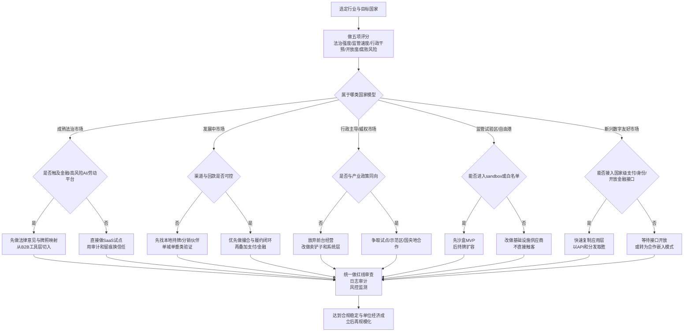

# 乘法世界下的行业选择与跨国制度判断

## 执行摘要

你前面提出的“乘法世界”问题意识，核心不是单纯追逐灰色套利，而是识别那些**技术可复制、边际成本持续下降、网络或数据会自我强化、同时规则尚未完全定型但可以被工程化合规**的赛道。你上传的背景文本把乘法杠杆概括为代码、资本、网络、判断力与地理/制度差异的叠加；把这个框架放到今天，更有价值的解读是：**制度盲区=规则尚在重分类、重协调、重执行的过渡区，而不是鼓励踩线**。fileciteturn0file0 citeturn10search14turn10search6turn1search1turn1search2

对创业者和投资人而言，当前最符合“指数级回报”条件的，不是所有高增长行业，而是六类更具体的方向：AI 原生企业软件、数据与 AI 合规基础设施、支付/风控/开放金融基础设施、受监管试验区支持的资产代币化基础设施、多边交易平台、以及在政策明示支持下的低空/机器人运营系统。它们共同特征是：技术杠杆强、复制成本低、产品可以跨客户复用、且护城河往往来自数据、流程嵌入、牌照协同或生态位，而非单一补贴。citeturn10search2turn10search6turn14search1turn12search7turn13search9

跨国比较时，国家模型会显著改变同一行业的胜率。大体上，AI 软件和数据合规层更适合成熟法治市场；支付/开放金融基础设施更适合国家级数字底座完善的新兴数字友好市场；资产代币化最适合监管试验区/自由港；低空与机器人运营更适合产业政策强、审批链条可预测的行政主导型市场；而消费型平台的窗口比十年前窄得多，只适合供给极度分散、且本地牌照边界清楚的垂类市场。citeturn0search0turn0search10turn17search12turn3search0turn3search6turn15search10turn2search1

最重要的结论只有一句：**2026 年还能做出乘法效应的机会，不在“绕开规则”，而在“把规则翻译成产品、接口和基础设施”**。一旦一个赛道的利润主要来自无牌照放贷、无边界采数、无资质运营或补贴换规模，它更像一次性政策租，而不是可复利的产业。citeturn8search0turn7search7turn1search6turn15search10

## 乘法行业的判定标准

如果把“乘法效应”拆开看，真正值得进入的行业通常同时满足五个条件：**技术杠杆**足够强，代码或模型一旦完成能反复部署；**网络效应或数据飞轮**能让后来的竞争者越来越难追；**边际成本**随着客户增加明显下降；**可复制性**高，产品能跨城市、跨行业、跨国家复制；**护城河**不只靠品牌，而是靠数据、流程嵌入、牌照协同、切换成本或标准位势。entity["organization","经合组织","oecd"]关于多边平台、数据锁定和数字市场竞争的研究，基本支持这一判断；你给出的杠杆框架也与此一致。fileciteturn0file0 citeturn10search0turn10search6turn14search1turn10search13

“制度盲区”最好分成三类来判断。第一类是**监管滞后**：新技术出现了，但现有法律还没有准确分类，例如生成式 AI 在不同司法区经历了从鼓励创新到风险分级的快速转向。第二类是**跨域法律冲突**：同一个业务同时落在运输、住宿、金融、数据、广告或劳动法下，早期增长快，但一旦被重新定性，估值和利润会被重写。第三类是**税制/补贴/试点窗口**：比如自由港、监管沙盒、数据流通试点、低空示范区，这类窗口往往合法、明确、时间有限，能放大先发优势，但不能替代真正的产品护城河。citeturn1search0turn1search1turn5search0turn5search4turn3search0turn13search0turn2search1

因此，判断一个行业能不能产生指数级回报，不该只问“市场大不大”，而要问三件事：**能否软件化复制，能否合规化扩张，能否在窗口关闭后仍然保有优势**。这也是为什么今天更优的创业切口，往往是为持牌机构、工业客户或政府鼓励的新基础设施提供“卖铲子”的系统层，而不是直接冲到最前台承担全部监管责任。citeturn10search14turn7search7turn3search8turn12search7

## 行业矩阵与近十年案例

下表把“行业 × 杠杆类型 × 进入路径 × 主要风险 × 合规对策”放在一起。它不是官方评级，而是基于近十年官方法规、判例、监管公告与行业演化做出的实务判断。citeturn10search6turn1search1turn1search2turn12search7turn2search1

| 行业 | 杠杆类型 | 近十年典型案例 | 典型进入路径 | 主要风险 | 合规对策 |
|---|---|---|---|---|---|
| AI 原生企业软件与 Agent | 代码复制、模型复用、工作流数据飞轮 | 欧盟 AI Act、中国生成式 AI 规则 | 从单一高价值流程切入，如客服、审单、知识管理、合规审核 | 幻觉、版权/训练数据、个人信息、自动化决策责任 | 人在回路、模型来源审计、日志留痕、私有化部署、用途分级 |
| 多边交易平台与本地服务网络 | 多边网络效应、撮合数据、支付闭环 | entity["company","优步","ride hailing"]、entity["company","Airbnb","home sharing"]、中国平台反垄断治理 | 先做供给碎片化的垂类，再叠加支付、履约和评分 | 牌照重分类、反垄断、劳动关系、消费者保护 | 单城试点、透明排序、避免独家/二选一、前置行业许可 |
| 支付、开放金融与嵌入式风控基础设施 | API 杠杆、清结算规模效应、风险模型复用 | entity["company","蚂蚁集团","fintech platform"]整改、印度 UPI/ULI、巴西 Pix/Open Finance | 与持牌机构共建，而非无牌直做资产端 | 无牌金融、KYC/AML、费率披露、资金隔离 | 持牌合作、名单制管理、隔离账户、审计报表、风控外包边界 |
| 数据治理、跨境数据与 AI 合规基础设施 | 合规代码化、规则引擎、文档自动化 | 中国数据跨境新规、欧盟 Data Act | 提供数据盘点、分级、传输合同、AI 治理台账 | 重要数据识别失败、跨境违规、行业秘密泄露 | 数据分类分级、本地化部署、标准合同/评估、第三方审计 |
| 资产代币化与数字资产基础设施 | 可编程合约、流动性网络、结算效率 | 新加坡 Project Guardian、香港 Project Ensemble、欧盟 MiCA、迪拜/阿布扎比框架 | 只做机构端、白名单用户、持牌托管与结算 | 证券法、托管、市场操纵、AML/制裁、散户误售 | 监管沙盒、法律意见、白名单、合格投资者、持牌托管 |
| 低空经济与机器人运营系统 | 软硬一体、调度算法、运力网络、场景复制 | entity["city","深圳","guangdong, china"]低空条例、中国无人驾驶航空器条例 | 从园区、巡检、港口、配送等封闭/半封闭场景切入 | 适航、空域审批、安全事故、保险责任 | 批准航线、电子围栏、保险、事件上报、分级运营资质 |

这些案例共同说明一个规律：窗口不是永远开着的。以 entity["organization","欧盟","supranational union"]判例与法规为例，Uber 先被法院认定为运输服务，短租平台随后又被纳入更完整的数据共享与执法框架；在中国，互联网金融从“鼓励真创新”迅速走向穿透监管、名单管理和牌照边界重申。相反，代币化并没有在主流市场消失，而是被重新装进由 entity["organization","新加坡金融管理局","singapore regulator"]、entity["organization","香港金融管理局","hong kong regulator"]和 entity["organization","国际清算银行","basel central bank forum"] 等机构主导的受控试点里；低空经济也不是“放开即飞”，而是随着 entity["organization","中国民用航空局","china aviation regulator"]规则和地方立法同步推进。citeturn5search0turn5search4turn8search5turn8search0turn7search7turn3search1turn3search6turn12search1turn2search1turn1search3

## 国家制度变量与进入评分

跨国判断时，建议把“国家/制度环境”先做成五变量评分卡：**法治强度**看规则是否可预期、司法和执法是否稳定；**监管速度**看对新业态是快速给出路径还是长期模糊；**行政干预倾向**看项目成败是否强依赖审批与政策风向；**市场开放度**看外资、数据、资本与人才流动限制；**腐败/合规风险**看执行是否透明、商业往来是否容易被非正式成本侵蚀。可操作的数据源，最常用的是 entity["organization","世界银行","multilateral lender"]的 WGI、entity["organization","世界正义项目","rule of law index"]的 Rule of Law Index、entity["organization","透明国际","anti corruption ngo"] 的 CPI，以及 OECD 的 FDI Restrictiveness。citeturn0search0turn0search10turn17search12turn17search3turn0search14turn0search8

本文把五类国家模型操作化为：成熟法治市场（如 entity["country","美国","north america"]、entity["country","英国","europe"] 与欧盟法域）；发展中市场（供给分散、增长快、但回款和执行不稳定）；行政主导/威权市场（政策协同价值高，但非政策同向业务面临更大不确定性）；监管试验区/自由港（如 entity["country","新加坡","southeast asia"]、entity["place","香港","sar, china"]、entity["organization","阿布扎比全球市场","abu dhabi, uae"]）；新兴数字友好市场（如 entity["country","印度","south asia"]、entity["country","巴西","south america"]、entity["country","巴林","middle east"] 等拥有国家级数字支付/开放金融基础设施的市场）。citeturn0search0turn0search10turn3search0turn3search6turn4search2turn11search0turn11search2turn4search1

**进入可行性评分（1=不建议，5=高适配）**

| 行业 | 成熟法治市场 | 发展中市场 | 行政主导/威权市场 | 监管试验区/自由港 | 新兴数字友好市场 | 核心理由 |
|---|---:|---:|---:|---:|---:|---|
| AI 原生企业软件与 Agent | 5 | 3 | 3 | 4 | 4 | 规则清晰、B2B 预算足；但高风险用途审查更严 |
| 多边交易平台与本地服务网络 | 3 | 4 | 2 | 3 | 4 | 发展中/数字友好市场更容易形成供给侧网络；成熟市场受劳动与竞争法约束更强 |
| 支付、开放金融与嵌入式风控基础设施 | 3 | 3 | 2 | 5 | 5 | 最依赖牌照和国家级 rails；沙盒与开放金融生态最友好 |
| 数据治理、跨境数据与 AI 合规基础设施 | 5 | 3 | 4 | 4 | 4 | 监管越复杂，越需要“规则翻译层” |
| 资产代币化与数字资产基础设施 | 2 | 2 | 1 | 5 | 4 | 机构端、白名单、持牌环境下最可做；散户/无牌模式风险极高 |
| 低空经济与机器人运营系统 | 3 | 2 | 4 | 3 | 3 | 成败取决于政策同向、基础设施与审批链条 |

读表的方法很简单：如果你的核心资产是**软件与审计能力**，优先选成熟法治市场或数字友好市场；如果核心资产是**牌照协同与金融基础设施创新**，优先选监管试验区/自由港；如果核心资产是**重运营硬件网络**，而且业务明确嵌入产业政策，则行政主导市场反而可能更快。相反，凡是依赖“先做起来再说”、以后再补牌照的模式，在金融、平台、低空、数据几个方向上都比十年前危险。citeturn1search0turn1search2turn3search0turn3search6turn15search10turn2search1turn7search7

## 各类国家的判断框架

五类国家的进入逻辑可以压缩成一句话：**成熟法治市场看规则清晰度，发展中市场看渠道与回款，行政主导市场看政策同向性，试验区/自由港看 sandbox 与牌照路径，数字友好市场看能否接入国家级 API 与支付/身份基础设施**。其中，印度的 ULI 与 UPI、巴西的 Pix 与 Open Finance，说明“国家先铺数字底座，再让民企做应用层”会显著提高 fintech 与 B2B 软件的进入效率；新加坡、香港、巴林和阿布扎比的做法，则说明创新窗口越来越偏向**受控试验**而不是野蛮生长。citeturn11search10turn11search0turn11search2turn4search1turn3search0turn3search6turn4search2turn3search3

这张流程图背后的原则是：**先判断制度适配，再判断行业空间；先拿到可复制的合法路径，再追求网络效应**。尤其当业务同时涉及资金、数据、算法和现实世界运营时，进入顺序错了，乘法就会变成负反馈。citeturn7search7turn1search6turn1search0turn15search10turn2search1

## 高优先级切入机会

下面五个方向，是我认为短中长期最值得优先验证的切口。共同特点是：既有明显的软件杠杆，又有明确的合规落点，不依赖“制度永远不来”。citeturn10search14turn1search1turn1search2turn3search6turn13search0

| 机会 | 时段 | MVP / 商业模式 | 关键指标 | 合规红线 | 应对策略 |
|---|---|---|---|---|---|
| 面向金融、制造、跨境电商的 AI Agent | 短期 | 单流程 Agent，按席位费+结果费收费 | 单任务准确率、人工替代率、单位成本、留存率 | 自动化决定、数据外泄、模型幻觉 | 人在回路、用途白名单、私有部署、模型日志 |
| 数据跨境与 AI 治理 SaaS | 短中期 | 数据盘点+分类分级+合同/评估自动化，订阅制 | 审批周期缩短、系统覆盖率、审计通过率 | 重要数据误判、敏感数据违规出境 | 本地化部署、DPO 机制、分级策略、第三方评估 |
| 垂直 B2B 交易平台 + 支付/风控插件 | 短中期 | 先做撮合和履约，再叠加持牌支付与授信合作 | GMV、复购率、应收周转、坏账率 | 无牌放贷、制裁/KYC、虚假贸易 | 持牌共营、KYC/AML、订单/发票核验、分账户管理 |
| 监管试验区内的机构型代币化基础设施 | 中期 | 白名单机构试点，收费来自技术服务+托管/结算合作 | 机构客户数、结算时效、失败率、留存 | 公开募资、无牌托管、市场操纵 | 仅机构端、法律意见、沙盒、持牌托管与信息披露 |
| 低空/机器人运行操作系统 | 中长期 | 园区/港口/巡检场景的调度、围栏、报备、保险接口 | 单日任务量、事故率、设备利用率、保费水平 | 无审批运营、事故责任、适航问题 | 批准场景先行、保险、电子围栏、事件上报体系 |

之所以优先推荐这五类，是因为它们都符合“规则翻译层”逻辑：AI Agent 对应 AI 风险分级与本地责任归属；数据治理 SaaS 对应跨境数据与 Data Act 类监管；B2B 平台若接上持牌支付和风控，能避开无牌金融；代币化只有在沙盒和持牌框架中才可能成为长期业务；低空/机器人则明显受益于政策明确支持和运营软件密集化。citeturn1search0turn1search2turn14search0turn7search7turn3search1turn3search6turn15search10turn2search1turn13search8

## 风险缓释与落地步骤

真正的风险缓释，不是写一套漂亮制度，而是把法律、财务、运营和声誉风险都做成有负责人、有阈值、有停机条件的日常机制。平台、金融、AI、数据和低空这几类业务，近十年的监管演化已经证明：**最先出问题的通常不是技术本身，而是“边做边补”的治理缺口**。citeturn18search0turn8search0turn7search7turn1search1turn2search1

| 维度 | 关键风险 | 实操步骤 |
|---|---|---|
| 法律 | 牌照错误、业务重分类、数据/算法侵权 | 先做 jurisdiction-by-jurisdiction 牌照清单；让本地律师出红线 memo；产品上线前做一次“最坏情形”重分类测试 |
| 财务 | 客户资金混同、坏账、补贴依赖、税务反噬 | 不碰客户资金就不碰；需要碰就隔离账户；授信只与持牌方共营；把补贴收入和主营收入严格拆分 |
| 运营 | 第三方失控、事故责任、系统不可审计 | 从单城/单园区开始；所有关键动作有日志和回放；供应商签署 SLA、审计权和数据责任条款 |
| 声誉 | 误导营销、算法歧视、监管点名 | 不夸大“AI 自动决策”“高收益”“零风险”；对外披露实际边界；建立事故与投诉 24 小时机制 |

落地步骤建议压缩为五步。第一，先选**国家模型**，而不是先选宏大赛道。第二，做一页纸**红线地图**：这门生意需要哪些牌照、触发哪三部法律、哪个环节最容易被重新定性。第三，先做**最小合规 MVP**，不要一开始就追求全国扩张。第四，把日志、权限、身份、回滚、审计、客户披露做成产品默认项，而不是上线后补丁。第五，只有同时满足“合规路径稳定、单位经济成立、复制效率真实存在”三项条件，才进入规模化。citeturn0search0turn17search12turn3search8turn1search6turn7search7turn15search10turn2search9

最后落到一句实话：今天的“赚大钱”路径，越来越像**在可扩张的技术杠杆上，叠加可验证的合规能力**。制度越完善，纯漏洞越短命；但越是规则复杂、跨域、需要接口和审计的地方，越容易诞生新的乘法公司。对创业者/投资人来说，最值得追的不是“还没人管”，而是“已经开始被管，但大多数人还不会合规地做”。citeturn10search6turn1search0turn1search2turn3search6turn12search7