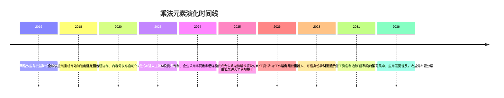
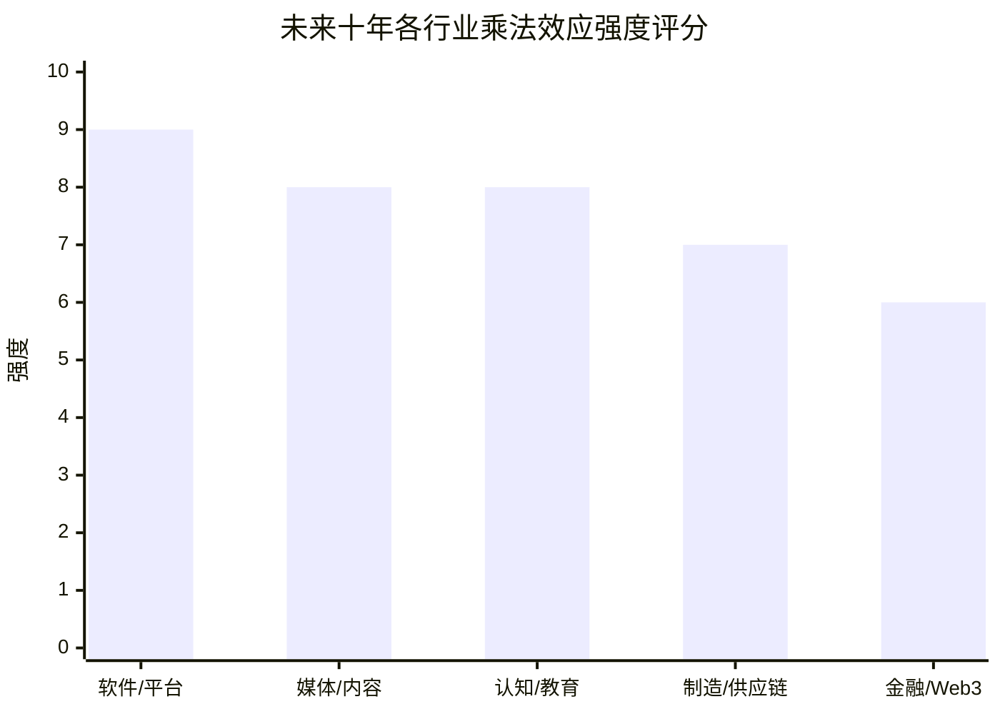

# 乘法世界未来十年趋势研究报告

## 执行摘要

本文将“乘法世界”操作化为一种现实经济结构：当资本、设备、代码、媒体、网络、信用与判断力能够以极低边际成本、强外部性、快速扩散和制度放大方式叠加时，单位投入会产生明显高于线性的回报。基于近十年数据与未来十年的驱动因素判断，我的结论是：**到 2036 年，乘法效应总体强度大概率继续加剧，但其主导形态将从“流量平台型乘法”转向“算力/模型/数据/工作流/合规/资本市场基础设施”复合乘法**。支撑这一判断的核心证据包括：AI 投资与采用率继续上升，2024 年美国私营 AI 投资达到 1091 亿美元，组织级 AI 使用率升至 78%；GenAI 专利家族从 2014 年的 733 件增长到 2023 年的 1.4 万余件；数字经济投资成为全球跨境投资中少数逆势增长板块；而生产率与劳动份额、平台集中与切换壁垒的研究仍显示高生产率主体能够在更低劳动分成下扩张。citeturn40search0turn14search9turn28view0turn12view1turn31view2

在 entity["country","中国","east asia state"]，这一趋势体现得尤其明显。官方资料显示，截至 2025 年 12 月，中国生成式 AI 用户已达 6.02 亿，普及率 42.8%；截至 2025 年底，累计 748 款生成式 AI 服务完成备案；国家知识产权局转引 entity["organization","世界知识产权组织","un ip agency"] 数据称，中国已成为全球 AI 专利最大拥有国，占比约 60%。这意味着未来十年中国会同时出现两种看似相反、实则并行的变化：一方面，AI 应用更加普及；另一方面，算力、规则、知识产权与场景落地门槛更高。citeturn35view0turn35view1

但“加剧”并不意味着所有单项元素都会同步增强。未来十年，**纯低工资地理套利、纯流量媒体分发、纯人工清算与纯人工中层管理**的独立杠杆会下降；相反，**判断力、工作流集成、可验证身份与出处、端侧 AI+机器人、受监管的代币化金融**会成为新的复合杠杆。换句话说，**元素总量未必减少，但旧元素的独立性会下降，复合元素会增加**。这一演化逻辑得到监管与行业实践的共同支持：entity["organization","欧盟","political union"] AI Act 与 DMA 正在削弱封闭锁定，entity["organization","国家互联网信息办公室","china cyberspace regulator"] 与 entity["organization","国家知识产权局","china ip agency"] 正推动 AI 服务备案和专利审查规则成形，而 entity["organization","欧洲央行","euro area central bank"] 与 entity["organization","国际货币基金组织","multilateral lender"] 对 tokenization 的论述已明显转向“受监管体系内的结构性迁移”。citeturn27search1turn27search2turn35view2turn25view1turn25view2

我的基准判断是“**加剧但分层**”：加剧情景概率约 **58%**，中性情景约 **27%**，减弱情景约 **15%**；总体置信度为**中等偏高**。最重要的不确定性不在于技术是否继续推进，而在于三类约束是否提前压制乘法扩张：监管与互操作是否显著削弱锁定，地缘碎片化是否把全球扩散速度拖慢到抵消技术增益，以及教育与组织改造能否赶上 AI 扩散速度。citeturn16search1turn15view0turn11view4turn30view0turn22search13turn22search3

## 研究设计与边界

“乘法世界”不是标准学术术语。本文采用你上传文本中的显性/隐性杠杆框架作为概念起点，把它映射为可观测代理指标：显性杠杆看资本强度、机器人与设备密度、劳动份额变化；隐性杠杆看网络效应与锁定、专利与代码可复制性、信用可组合性、地理与城市集聚、媒体分发效率，以及判断力对组织绩效的放大作用。你上传的文本仅作为概念框架来源，而非事实证据来源。fileciteturn0file0 citeturn12view1turn15view0turn37view0turn25view0

证据主要来自 entity["organization","经合组织","economic policy body"]、entity["organization","联合国贸发会议","un trade body"]、entity["organization","世界贸易组织","trade body"]、entity["organization","国际劳工组织","un labour agency"]、entity["organization","联合国教科文组织","un education agency"]、entity["organization","斯坦福 HAI","stanford ai institute"]等近十年的官方或原始资料，并辅以 NBER 论文和少量平台原始披露。之所以不构造一个单一“乘法指数”，是因为目前并不存在跨行业、跨国家、跨技术层可统一比较的正式指标；所以本文采用“浓度 + 扩散 + 资本门槛 + 自动化 + 制度约束”五类代理变量做综合判断。citeturn12view1turn31view2turn28view0turn29view0turn22search13turn38view0

需要特别强调的是，任务层面的乘法提升并不等于宏观层面的立即兑现。NBER 的客服实验显示 GenAI 能提升生产率，但丹麦行政数据的研究又显示，两年内工资和工时未出现显著总体变化。这意味着“乘法效应”常常先出现在任务层、头部企业和基础设施层，然后才慢慢传导到行业利润、工资结构与宏观增长。citeturn8search2turn8search18

## 近十年回顾

过去十年，最强的增量来自“代码杠杆 + 资本杠杆 + 平台杠杆”的合流。根据 entity["country","美国","north america state"] 的 AI Index 数据，2024 年美国私营 AI 投资达到 1091 亿美元，接近中国的 12 倍；组织使用 AI 的比例从 2023 年的 55% 跃升到 2024 年的 78%，至少在一个业务环节使用 GenAI 的比例从 33% 升至 71%。与此同时，全球 GenAI 专利家族十年增长超过 800%，说明“算法/代码”已经从生产工具变成可投资、可复制、可防御的资产类杠杆。citeturn40search0turn14search9turn20search1turn20search11

但过去十年的另一面，是收益分配越来越不均匀。OECD 的跨国研究显示，持续低劳动份额的“超级明星”企业对总体劳动份额构成持续下压；在制造业，这类企业十年内的增加可解释样本国家平均劳动份额降幅的一半以上。另一项 OECD 研究发现，欧洲 2012—2021 年行业集中度上升 2.9 个百分点，产品集中度上升 1.1 个百分点，而产品市场平均集中度本来就高达 61%。这说明乘法效应在现实中并不只是“人人可用的工具”，更是“少数主体更容易放大的结构”。citeturn12view1turn31view2

平台化进一步强化了这种结构。英国监管者对云服务市场的调查显示，前两大云服务商各自占到英国客户云支出的至多 40%，并伴随明显的技术与商业切换壁垒；与此同时，DMA 体系下当前被指定的 gatekeeper 提供 23 项核心平台服务。网络效应正在从早期“用户越多越强”演化为“数据越多、工作流越深、切换越难、合规成本越高越强”。citeturn15view0turn16search1turn16search15

地理杠杆并没有消失，而是在升级。联合国数据显示，全球人口已在 2024 年达到接近 58% 城市化，长期趋势仍指向更高城市集中；WIPO 2025 显示，前 100 个创新集群大约占全球 70% 的 PCT 申请与 VC 交易，前 10 个集群占约 40% 的 PCT 申请。以 entity["city","深圳","guangdong, china"] 为代表的创新—制造复合集群说明，未来更有效的地理套利不是简单把工厂搬到低工资地区，而是把研发、验证、制造、融资和政策支持压缩到高密度城市—区域网络中。citeturn24search16turn24search4turn37view0turn37view1

制造与供应链层面则出现“双重运动”。一方面，自动化设备杠杆显著增强：2024 年全球工业机器人存量达 466 万台，中国占 2024 年全球新装机量的 54%，运营存量突破 202 万台，占全球 43%。另一方面，地缘碎片化又在改变全球乘法路径。IMF 对连接国的研究表明，entity["country","越南","southeast asia state"]更多体现为贸易重配置而非简单转口；而 OECD 则指出，若大规模回流和区域化显著加深，全球贸易可能收缩逾 18%，全球 GDP 降幅可能超过 5%。所以，未来的地理杠杆会从“全球最低成本”转向“多节点容错 + 关键中间品控制 + 友岸集群”。citeturn39view0turn39view1turn30view0turn11view4turn5search12

金融层面的“信用杠杆”也在变化。UNCTAD 2025 显示，数字经济以 10%—12% 的年增速扩张，而发展中经济体过去五年吸引了 5310 亿美元数字经济绿地投资，但高度集中于少数国家；欧洲央行则指出，公共链上的代币化资产从 2024 年初的 74 亿欧元增至 2026 年 2 月的 380 亿欧元，受监管体系内的 tokenized money market funds 在 2025 年翻倍至约 63 亿欧元。结论很清楚：未来十年“信用与清结算杠杆”不会消失，而是从人工中介和纸面流程演化为**可编程、可组合、可审计**的信用基础设施。citeturn28view0turn28view1turn25view0turn25view2

上图综合了技术扩散、平台监管、数字投资、自动化设备与金融基础设施的共同演化逻辑。其核心含义不是“所有东西都越来越垄断”，而是“**扩散更快、上游更集中、下游更普及**”。citeturn21view0turn40search0turn28view0turn25view0turn12view1

## 情景分析与判断

如果把未来十年拆成三种情景，最关键的分水岭不是 AI 是否继续进步，而是“扩散速度”能否快过“规制、地缘与组织摩擦”的上升速度。WTO 在 2025 年报告中已经给出很有启发性的三类框架：技术分化、政策追赶、技术追赶。本文在此基础上，结合平台监管、数字投资、机器人扩散与 tokenization 进展，给出下表。citeturn29view0turn27search1turn11view4turn25view2

| 情景 | 概率 | 乘法效应方向 | 主要触发条件 |
|---|---:|---|---|
| 加剧 | 58% | 总体更强，且更偏上游集中 | AI agents 与工作流自动化普及；算力与能源门槛维持高位；数字投资继续集中；tokenization 在受监管金融内扩张；教育改革追不上应用扩散 |
| 中性 | 27% | 强度维持高位，但增速放缓 | 开源模型与低成本推理显著降低应用门槛；互操作与反垄断削弱平台锁定；组织改造和技能供给部分跟上 |
| 减弱 | 15% | 乘法强度下降，收益更平均 | 严格互操作与反垄断显著削弱锁定；严重地缘冲突拖慢扩散；能源、合规和数据主权成本压制规模化；教育与公共工具显著缩小认知差距 |

**结论一：未来十年“乘法效应总体强度”大概率加剧。** 我的置信度为中等偏高。最关键的证据有三组：第一，AI 的资本、专利与采用率仍在同时加速；第二，技术扩散速度越来越快，但收益捕获仍集中于基础设施和集群节点；第三，监管并不是简单“去乘法”，而是在把乘法从封闭锁定转向受监管、可审计、可验证的轨道。净效果不是消失，而是**更深、更隐、更复合**。citeturn40search0turn21view0turn37view1turn25view2turn27search1turn35view1

## 元素演化与行业矩阵

下表直接回答“哪些元素会减少、消失或新出现”。

| 杠杆类型 | 未来十年判断 | 时间窗口 | 原因 |
|---|---|---|---|
| 资本 | **增强** | 2026—2036 | AI、数据中心、芯片、机器人和并购都提高了固定投入门槛 |
| 劳动力 | **相对减弱** | 2026—2032 | 纯管理型扩张被 AI 工具与流程自动化替代，但高技能协同仍重要 |
| 设备 | **增强** | 2026—2036 | 工业机器人、边缘设备、智能终端成为新放大器 |
| 判断力 | **显著增强** | 2026—2036 | 当内容与代码更便宜时，问题定义、取舍与纠偏更稀缺 |
| 网络效应 | **演化** | 2026—2031 | 从用户数量优势转向数据闭环、API/工作流锁定与生态位控制 |
| 信用 | **演化并增强** | 2027—2036 | 从人工授信/清结算转向 programmable trust 与嵌入式合规 |
| 逻辑压缩 | **显著增强** | 2026—2036 | LLM 降低信息处理成本，但提高高质量判断与压缩能力价值 |
| 地理套利 | **传统形式减弱，复合形式增强** | 2026—2034 | 低工资套利受关税、出口管制与近岸化压制；集群套利与连接国套利增强 |
| 算法/代码 | **增强但低端商品化** | 2026—2031 | 基础编码更便宜，优势转向数据、场景、集成与治理 |
| 媒体 | **量的乘法增强，单条内容收益减弱** | 2026—2030 | AI 使内容爆炸，稀缺环节转向 IP、出处、社群与分发控制 |

上表的综合结论是：**会减少的是“单一杠杆”的独立胜率，不是杠杆本身；会新出现的是“复合杠杆”**。citeturn40search0turn18view0turn25view2turn30view0turn12view1turn22search13

上图是本文的综合评分，不是官方指数。评分依据是五项因子：低边际成本、集中度、资本/设备门槛、扩散速度、监管摩擦。citeturn15view0turn16search1turn39view0turn25view0turn17search4turn22search13

| 行业 | 未来影响强度 | 主要机会 | 主要风险 |
|---|---:|---|---|
| 软件/平台 | 9/10 | agents、工作流平台、企业级集成、数据闭环 | gatekeeper 监管、云锁定、模型成本与算力依赖 |
| 制造/供应链 | 7/10 | 机器人、端侧AI、连接国产能、研发制造同城化 | 关税、出口管制、能源成本、供应链双重冗余 |
| 金融/Web3 | 6/10 | 代币化债券/MMF、嵌入式合规、可编程清结算 | 法规碎片化、流动性不足、代码风险、系统性传染 |
| 媒体/内容 | 8/10 | 多模态生产、IP 运营、社群与品牌、长尾全球分发 | AI 内容泛滥、版权争议、平台依赖、声誉稀释 |
| 认知/教育 | 8/10 | 个性化辅导、AI 助教、技能放大、低成本知识供给 | 学习质量验证困难、技能分化、作弊与真实性问题 |

行业判断的一个关键例子是媒体。entity["company","YouTube","video platform"] 披露其创作者生态在美国 2024 年贡献超过 550 亿美元 GDP、支持 49 万个全职岗位，并强调创作者可分得 55% 的广告与订阅收入；而 entity["company","Spotify","music streaming"] 则表示 2025 年向权利人支付超过 110 亿美元，同时警告 AI impersonation 与“内容垃圾”正在侵蚀真实作者收益。由此可见，媒体杠杆没有消失，而是从“产出更多内容”转向“拥有分发、IP、可信身份与跨平台社群”。citeturn17search4turn17search13turn18view0

## 对个人与企业的应对策略

未来十年最稳妥的策略，不是赌某个单一工具，而是沿“技能—组织—资本配置”三条线同时重构。因为 ILO 估计全球约四分之一岗位会被 GenAI 改造，IMF 估计接近 40% 的全球就业会暴露于 AI，OECD 则反复强调技能与组织吸收能力是实际收益兑现的关键瓶颈。citeturn22search13turn22search18turn22search3

| 对象 | 排序 | 短期 | 中期 | 长期 |
|---|---|---|---|---|
| 个人 | 技能 | 学会用 AI 做检索、总结、写作、分析与原型；尤其要训练问题定义与验证能力 | 建立“行业知识 + AI 工具 + 判断力”组合，而非只学提示词 | 把自己培养成能管理一组数字代理和外部资源的“复合型节点” |
| 个人 | 组织 | 主动进入高杠杆组织：有数据、有客户、有分发、有资本约束意识 | 争取靠近产品、销售、供应链或投融资等高反馈环节 | 形成个人品牌、作品库、社群与可信履历，减少对单一平台依赖 |
| 个人 | 资本配置 | 少押注纯概念，优先投资能提高自己生产率的工具与训练 | 逐步配置能形成复利的资产：股权、知识产权、可持续现金流 | 长期目标是从“卖时间”转向“持有系统、资产或版税” |
| 企业 | 技能 | 把 AI 培训从“通识课”改成“按岗位拆任务”的 workflow training | 建立内部评测、数据治理、模型治理与审计能力 | 形成企业专属数据、知识库和 agent 编排能力 |
| 企业 | 组织 | 先改流程再上模型；优先改造客服、销售、采购、研发辅助、合规 | 用产品经理 + 业务负责人 + 数据/工程共治，而不是把 AI 外包给单一技术部门 | 将企业组织从“人海分工”转向“少数高判断者 + 自动化执行网络” |
| 企业 | 资本配置 | 先投可验证 ROI 的应用；慎投大而全平台 | 中期在数据、接口、机器人、终端和安全合规上补基础设施 | 长期同时布局三类资产：数据资产、软件/模型资产、可组合金融与供应链能力 |

真正的排序原则只有一句话：**先配“可迁移技能”，再配“高反馈组织位置”，最后才是“高波动资本敞口”**。对企业也是一样：先做流程和数据，再做模型和财务工程。citeturn40search0turn22search3turn25view2turn39view0

## 假设与不确定性

本研究的主要假设与不确定性如下。

- 本文默认的回顾期是 **2016—2026**，预测期是 **2026—2036**。  
- “乘法世界”不是现成统计口径，本文用的是代理指标综合判断，而不是官方统一指数。  
- 因跨行业 HHI/Gini 数据不可统一获取，本文更多使用 **CR4、劳动份额、gatekeeper 数量、平台切换壁垒、专利/投资集中度** 等可比代理。citeturn31view2turn15view0turn16search15
- tokenization 市场仍小，部分规模数据由行业数据库经央行加工后引用，因此方向可信、精确规模的长期外推仍需谨慎。citeturn25view0turn25view2
- 地方政府关于 entity["city","深圳","guangdong, china"] 的材料在本文中仅用作“高密度研发—制造—资本协同”的案例，而非全球平均水平。citeturn36view0turn36view1turn36view2
- 技术扩散越来越快，但 WIPO 同时指出知识与吸收能力仍集中在少数发达经济体；因此“更快扩散”并不自动等于“更平均分配”。这也是本文把基准情景定义为“加剧但分层”的根本原因。citeturn21view0turn37view1